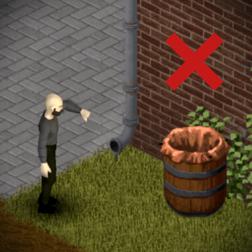
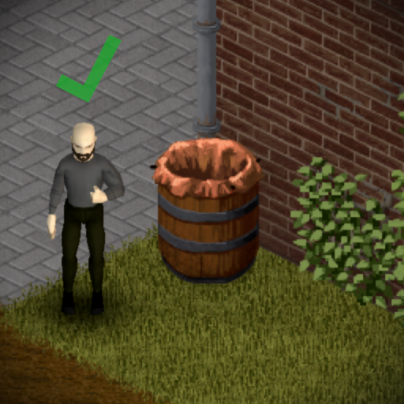
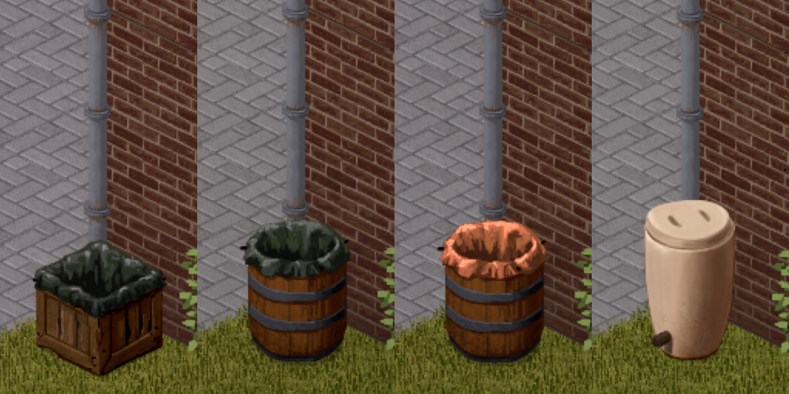

# Functional Gutters
Functional Gutters is a mod for the video game `Project Zomboid [B42]` that increases the effectiveness of rain collectors when they are placed on the same tile as a gutter drain pipe.

This behavior is meant to represent the rain water being funneled from the building's roof through the gutter pipes and into the connected collector.

<br/>

<p align="left">



</p>

## FAQ

### Can this mod be safely added mid-save?

* Yes, but it will not change any already existing collectors that happen to be placed on a gutter tile.


### Can this mod be safely removed mid-save?

* Yes, but any existing collectors on a gutter tile will keep their increased rain factor.


### Do gutter collectors work indoors?

* No, currently the only value changed is the entity's `RainFactor` which still requires being outdoors without an overhead tile.


## Options 

#### `Gutter Rain Factor`

The rain factor applied to collectors on gutter tiles which is `0.8` by default. For context, crates are `0.4` and barrels are `0.25` by default. Range goes from `0.5` to `3.0`.

***

#### `Debug Mode`

Prints extra info to console.

***

#### `Show Context UI`

Adds a section for mod-specific data in the right-click context menu.


#### Notes:

* Located in the main options menu: `Options -> Mods -> Functional Gutters`
* Changes to `GutterRainFactor` will only impact newly built/placed items.
* A reload/restart is required for changes to `DebugMode` or `ShowContextUI` to apply.

### Supported Collector Entities
* [x] Rain collector crate
* [x] Rain collector crate (tarp)
* [x] Rain collector barrel
* [x] Rain collector barrel (tarp)
* [x] Amphora
* [ ] Single-tile feeding troughs
* [ ] Multi-tile feeding troughs
* [ ] Placeable world inventory items (pots)
* [ ] Generic multi-tile entities with `FluidContainers`
* [ ] Non-`FluidContainer` entities that fit thematically (bathtub, toilet)
* [ ] Generic movable entities with `FluidContainers` (tanker trailer)

<br/>

<p align="left">

</p>

### Accepted Drainage Sprites
```
{
    -- Mostly used in water towers
    "industry_02_76",
    "industry_02_77",
    "industry_02_78",
    "industry_02_79",

    -- Vertical pipes with curve bottom
    "industry_02_236",
    "industry_02_237",
    "industry_02_240",
    "industry_02_241",
    "industry_02_242",
    "industry_02_244",
    "industry_02_245",
    "industry_02_246",
    "industry_02_260",
    "industry_02_261",
    "industry_02_262",
    "industry_02_263",
    -- TODO gotta catch em all
}
```

## How It Works
Build 42 introduced a great variety of of new sprites that decorate buildings, however most are purely aesthetic and don't impact any systems in the game. Several buildings on the map use the new industrial pipe sprites to create roof gutter drains which inspired the creation of this mod.

This mod allows these new gutter sprites to serve a functional purpose by increasing the amount of rain water collected for any rain collectors placed on the same grid square.

The increased rain factor is controlled by the mod option `GutterRainFactor` and can be changed through the mod options menu. This value defaults to `0.8` (2x the base value of crates and nearly 3x the base value of barrels) and can be customized in the mod's options panel to a value between `0.5` and `3.0`.

When a supported collector entity is built or placed on a square, the mod compares all object sprites in the square against a mod-managed list of gutter sprites. 
- If the newly-placed collector shares a square with one of the "approved" sprites, its rain factor is set the to `GutterRainFactor`. 
- If it doesn't share a square, a quick equality check is made against the entity's base rain factor and a reset occurs if there is any difference between these values.


***
#### Fun Fact

In the base game, the square rain collector crates have a much greater base rain factor (`0.4`) compared with the circular rain collector barrels (`0.25`) meaning they will collect rain much faster. This makes some sense as the crate's square opening covers a larger surface area than the barrel's circular opening but these details aren't ever surfaced to the player.

***

<br/>

Even though crates and barrels have a different base rain factor, this mod sets both types to the same rate `GutterRainFactor` when they are on an active drain pipe tile. When connected to the gutter system, the diameter of the pipes would be more important than the size of the container's open face so the current version of the mod treats all containers the same. That said, I am open to potentially exploring more involved options - such as including the size of the building's roof as a variable in the equation - at a later date.


## TODO / TBD
* Add any missing drain pipe sprite identifiers!
* Support for variable gutter rain factor that scales with roof size?
* Support stacked/multi tier rain collectors with connected pipe?
* Support manually adding custom sprites to the core gutter list?
* Buildable gutters?
* Connectable containers?


<br/>


<br/>

Please feel free to suggest ideas or provide missing sprite references that would fit the theme of this mod!


## 1.1
TODO
- Use better display name for container object in context ui
    - fallback to using the fluid container name
- Add translation for context ui text

Changelog
- Added connect & disconnect plumbing actions 
    - Includes "Requires Pipe Wrench" mod option which defaults to True
    - Available through the right-click context menu when a tile contains both a gutter drain and a valid fluid container object
- Support for animal troughs
    - NOTE: depending on placement, 2-tile troughs may require the game to be reloaded before they can be connected to the gutter. This is due to how the game treats multi-tile objects 
- Support for generic fluid container iso objects
    - Works with the Useful Barrels mod
