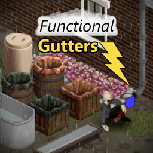
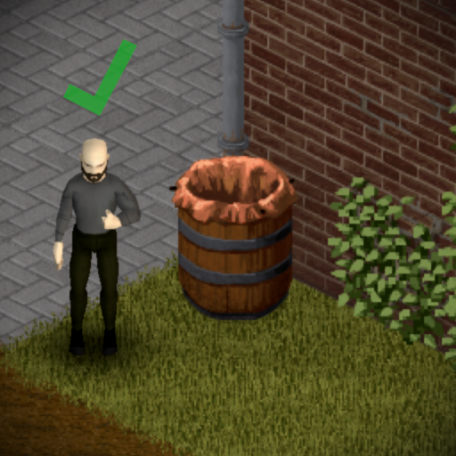
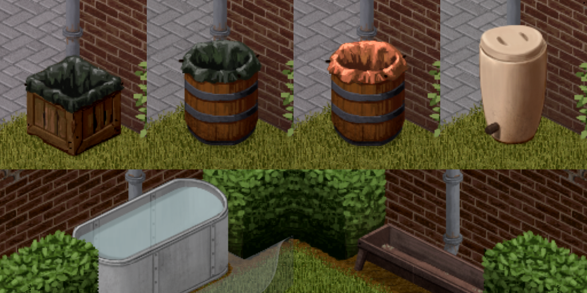
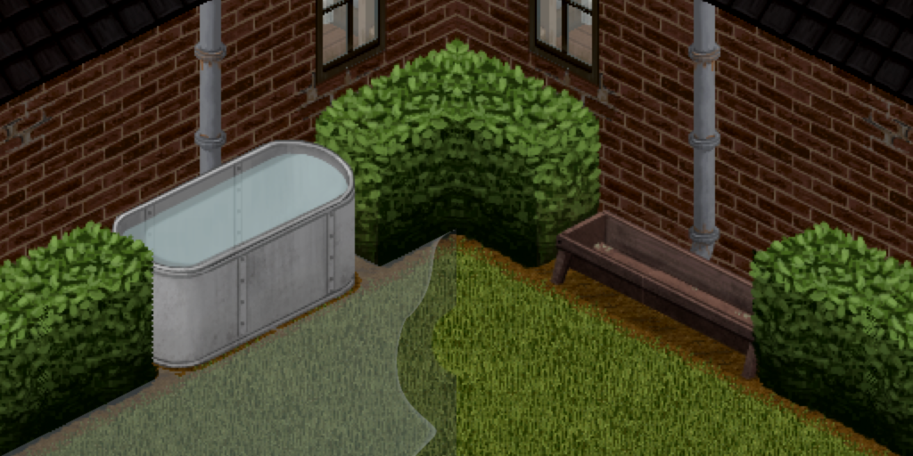

# Functional Gutters
Functional Gutters is a mod for the video game `Project Zomboid [B42]` that enables rain collectors and other fluid containers to be connected with a gutter drain pipe for increased efficiency.

This behavior is meant to represent the rain water being funneled from the building's roof through the gutter pipes and into the connected collector.

<br/>

<p align="left">



</p>

## FAQ

### Can this mod be safely added mid-save?

* Yes, but it will not change any already existing collectors that happen to be placed on a gutter tile.


### Can this mod be safely removed mid-save?

* Yes, but any existing collectors on a gutter tile will keep their increased rain factor.


### Do gutter collectors work indoors?

* No, currently the only value changed is the entity's `RainFactor` which still requires being outdoors without an overhead tile.

### What can I connect to the gutter?

* All vanilla rain collectors, troughs, and the amphora are supported. Additionally, any modded entities that use the game's FluidContainer system should work out of the box such as the Useful Barrels mod.

### Does this work for build 41?

* This mod relies on systems introduced in build `42.4+` and will not function in build `41`.

## How To Use

1. Place supported collector on the same tile as a gutter drain.
    - Either tile will work for multi-tile troughs.

2. Open the context menu by right-clicking on the collector.

3. Find the `Gutter Drain` submenu and select the `Connect` option.
    - Requires a pipe wrench (mod option)

4. Enjoy the benefits of a fully functional rain collector system.


## Options 

#### `Gutter Rain Factor`

The rain factor applied to collectors on gutter tiles which is `1.6` by default. For context, crates are `0.4` and barrels are `0.25` by default. Range goes from `1.0` to `10.0`.

***

#### `Require Pipe Wrench`

If true, requires a pipe wrench to connect/disconnect containers with a gutter.

***

#### `Debug Mode`

If true, prints debug messages to the console and adds an additional context menu option.

***


#### Notes:

* Located in the main options menu: `Options -> Mods -> Functional Gutters`
* Changes to `GutterRainFactor` will only impact newly built/placed items.
* A reload/restart is required for changes to `DebugMode` to apply.

## Supported Collectors
* [x] Rain collector crate
* [x] Rain collector crate (tarp)
* [x] Rain collector barrel
* [x] Rain collector barrel (tarp)
* [x] Amphora
* [x] Single-tile feeding troughs
* [x] Multi-tile feeding troughs
* [x] Generic placeable entities with `FluidContainers`
* [ ] Placeable world inventory items (pots)
* [ ] Generic multi-tile entities with `FluidContainers`
* [ ] Generic movable entities with `FluidContainers` (tanker trailer)

<br/>

<p align="left">


</p>

## Accepted Drainage Sprites
```
{
    -- Mostly used in water towers
    "industry_02_76",
    "industry_02_77",
    "industry_02_78",
    "industry_02_79",

    -- Vertical pipes with curve bottom
    "industry_02_236",
    "industry_02_237",
    "industry_02_240",
    "industry_02_241",
    "industry_02_242",
    "industry_02_244",
    "industry_02_245",
    "industry_02_246",
    "industry_02_260",
    "industry_02_261",
    "industry_02_262",
    "industry_02_263",
    -- TODO gotta catch em all
}
```

## Details
Build 42 introduced a great variety of of new sprites that decorate buildings, however most are purely aesthetic and don't impact any systems in the game. Several buildings on the map use the new industrial pipe sprites to create roof gutter drains which inspired the creation of this mod.

This mod allows these new gutter sprites to serve a functional purpose by increasing the amount of rain water collected for any rain collectors placed on the same grid square (and connected).

The increased rain factor is controlled by the mod option `GutterRainFactor` and can be changed through the mod options menu. This value defaults to `1.6` (4x the base value of crates `0.4`, over 6x the base value of barrels `0.25`, and over 3x the base value of troughs `0.55`) and can be customized in the mod's options panel to a value between `1.0` and `10.0`.

When a supported collector entity is built or placed on a square, the mod compares all object sprites in the square against a mod-managed list of gutter sprites. If the newly-placed collector shares a square with one of the "approved" sprites, it is allowed to be connected to the gutter. The connect action set the object's rain factor to that of the mod's `GutterRainFactor`. The disconnect action changes the object's rain factor back to its default.


### Fun Fact

In the base game, the square rain collector crates have a much greater base rain factor (`0.4`) compared with the circular rain collector barrels (`0.25`) meaning they will collect rain much faster. This makes some sense as the crate's square opening covers a larger surface area than the barrel's circular opening but these details aren't ever surfaced to the player. 

Then troughs come in with the highest rain factor (`0.55`) of vanilla items. While this rate might not make as much sense for the skinny wooden troughs, most would probably agree that animal welfare comes before "realism".


## TODO / TBD
* Add any missing drain pipe sprite identifiers
* Support for variable gutter rain factor that scales with roof size? **<---- Probably Next**
* Support stacked/multi tier rain collectors with connected pipe?
* Support manually adding custom sprites to the core gutter list?
* Buildable gutters?
* Chainable containers?

<br/>


<br/>

Please feel free to suggest ideas or provide missing sprite references that would fit the theme of this mod!


## Changelog 
### 1.1
- Support all vanilla animal troughs
- Support generic fluid container iso objects
    - Confirmed with the Useful Barrels mod
- Add connect & disconnect plumbing actions 
    - Includes "Require Pipe Wrench" mod option which defaults to True
    - Available through the right-click context menu when a tile contains both a gutter drain and a valid fluid container object


### 1.2 Notes

TODO High Priority
- Fix multi-tile trough in several areas where container is checked
- Set scrap definition for all pipes
- Add tile props to all pipes
- Build full mod info panel 
- Fix ui panel not reacting to placing container on drain tile
- Invert building def check in drain pipes when source drain is on a player built structure
    - instead of reducing drain pipes to those that share the same building, reduce the pipes to those not attached to a building
- Disable button & add tooltip when wrench is required in ui panel
- Add all build icons
- Add all text translations
- Update README

TODO Medium Priority
- Add ui feedback for specific needs when building pipes
- Reorder tilesheets?
- Persist 'mode' on drain pipe object as mod data
- Crawl perimeter of vanilla building in drain check instead of radial search
    - Will need to test with large buildings

TODO Low Priority
- Use gutter pipes as a means to manually switch from pre-built to player-built mode on pre-built buildings.
    - ex: 
    - some garages are still tagged as the the same building even when physically separate.
    - this would allow players to easily use them without impacting things like drain limit on the main building
- Take roof angle into consideration?
- Feedback in build menu when placing pipes?
- Add additional gutter material types
    - clay using inverted clay tiles and clay pipes
- Water overlay during storms?
    - overlaySpriteColor
    - renderOverlaySprites
    - will need depthmask defined
- Drain sound effect during storms? 
    - https://theindiestone.com/forums/index.php?/topic/70279-help-with-adding-sound-to-function/
    - https://www.youtube.com/watch?v=FNWgHP9O9tw

Notes:
- Look into spriteconfig LogicClass for placement logic (ex: LogicClass      = WoodenWall,)
- Look into spriteconfig corner option (ex: corner = constructedobjects_01_76,)
    - might be specifically related to the sprite logic class
