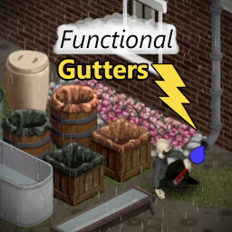
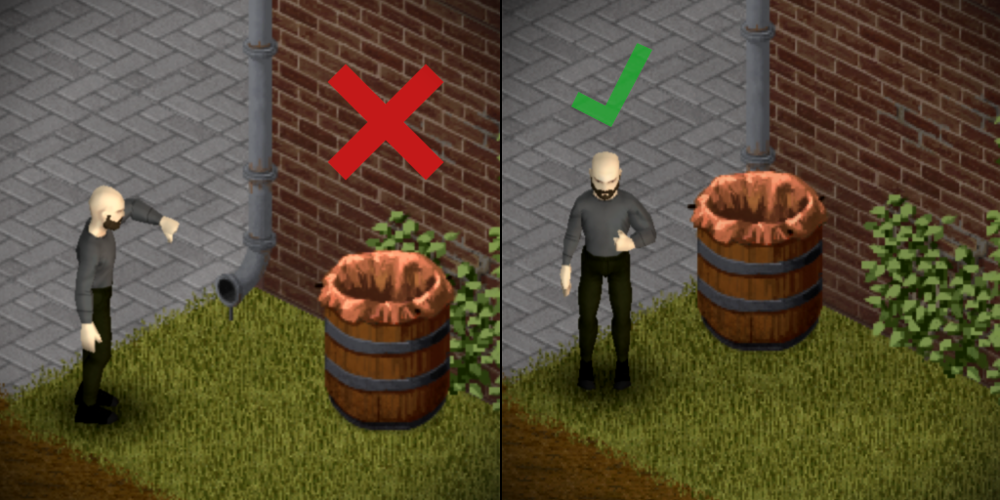
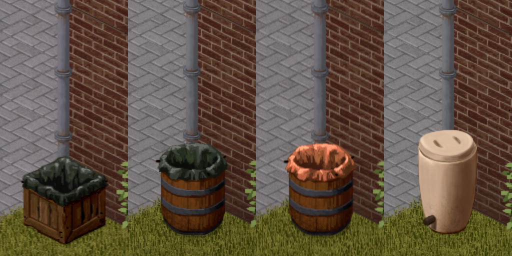

# Functional Gutters
Functional Gutters is a mod for the video game `Project Zomboid [B42]` that introduces an entirely new system to the game enabling players to realistically harvest rain water from a building's gutter drain using connected rain collectors and other fluid containers. Players can tap into existing gutters or build their own custom gutter system using a variety of new craftable gutter pipes. The efficiency and effectiveness of the system is influenced by parameters such as by the size of the roof and the configuration of the gutter pipes giving players new survival strategies, new goals, and more functional decorations to personalize their bases.

 

## FAQ

### Does this mod work in multiplayer (build 42.13+)?

* Yes, the mod has been updated with initial multiplayer support. Servers will use the default mod options (1.0 rain factor, pipe wrench required) until configurable sandbox values are added in a future update.

### Can this mod be safely added mid-save?

* Yes, but it will not change any already existing collectors that happen to be placed on a gutter tile.

### Can this mod be safely removed mid-save?

* Yes, but any existing collectors on a gutter tile will keep their increased rain factor.

### Do gutter collectors work indoors?

* No, currently the only value changed is the entity's `RainFactor` which still requires being outdoors without an overhead tile.

### What can I connect to the gutter?

* All vanilla rain collectors, troughs, and the amphora are supported. Additionally, any modded entities that use the game's FluidContainer system should work out of the box such as the Useful Barrels mod.

### Does this work for build 41?

* This mod relies on systems introduced in build `42.4+` and will not function in build `41`.

## How To Use

1. Place supported collector on the same tile as a gutter drain.

2. Open the context menu by right-clicking on the collector.

3. Find the `Gutter Drain` submenu and select the `Connect` option.
    - Requires a pipe wrench (mod option)

4. Enjoy the benefits of a fully functional rain collector system.

### Pre-Existing Structures
Pre-existing structures already have roof gutters meaning you won't have to build your own. To tap into these roof gutters, you will either need to find a building with an existing drain pipe or build a new drain pipe.

On its own a drain pipe will reach the next level above. Additional vertical pipes can be built on top of the drain pipe to access roofs on higher floor levels.

### Player-Built Structures
Unlike pre-existing structures, player-built structures will require horizontal gutter pipes to expand the size of the roof's area being covered by the drain pipe. Each gutter pipe can collect rain from up to 4 grid-squares from its attachment point in a line. A roof square will be considered valid if it has a floor, isn't covered by a roof, and isn't occupied by an item such as a rain collector.

Use the "View Pipes" and "View Roof" buttons in the gutter ui panel to help visualize the connected pipes and covered roof area.

## Options 

#### `Roof Rain Factor`

The rain factor for a single square of roof which defaults to `1.0`. Used as a primary parameter when calculating the rain factor for the gutter system as a whole. Range goes from `0.0` to `2.0`.

***

#### `Require Pipe Wrench`

If true, requires a pipe wrench to connect/disconnect containers with a gutter.

***

#### `Debug Mode`

If true, prints debug messages to the console and adds an additional context menu option.

***

#### Notes:

* Located in the main options menu: `Options -> Mods -> Functional Gutters`
* Changes to `GutterRainFactor` will only impact newly built/placed items.
* A reload/restart is required for changes to `DebugMode` to apply.

## Supported Collectors
* [x] Rain collector crate
* [x] Rain collector crate (tarp)
* [x] Rain collector barrel
* [x] Rain collector barrel (tarp)
* [x] Amphora
* [x] Single-tile feeding troughs
* [x] Multi-tile feeding troughs
* [x] Generic placeable entities with `FluidContainers`
* [ ] Placeable world inventory items (pots)
* [ ] Generic multi-tile entities with `FluidContainers`
* [ ] Generic movable entities with `FluidContainers` (tanker trailer)

 

 

## Changelog 
### 1.4
- Add multiplayer support (build 42.13+)

### 1.3
- Much improved pipe & roof mapping
    - Previously for pre-existing structures: all gutter systems on the same building were considered 'associated'
    - Previously for player-built structures: all gutter systems in the vicinity were considered 'associated'
    - Now: only gutter systems with connected pipes or overlapping roofs are 'associated'
- Reduced the radius of the restriction zone when building a new drain near existing drains from 6 to 3 
    - Originally was a stop-gap solution to prevent some unbalanced/unrealistic edge case setups
    - Decreased now as the new mapping systems solves most of the avenues for abuse
    - Might decrease or remove completely in future updates
- Updates to match changes in vanilla animal trough definitions from 42.10

### 1.2
- Add buildable gutter pipes
    - Supports both pre-existing and player-built structures
- Use roof size to determine rain factor
    - Pre-existing structures are assumed to already have gutters so the entire roof's area is used for rain harvesting
    - Player-built structures require crafted gutter pipes to increase the area available for rain harvesting
- Add gutter system ui panel
- Add newspaper classified ad for in-game tutorial

### 1.1
- Support all vanilla animal troughs
- Support generic fluid container iso objects
    - Confirmed with the Useful Barrels mod
- Add connect & disconnect plumbing actions 
    - Includes "Require Pipe Wrench" mod option which defaults to True
    - Available through the right-click context menu when a tile contains both a gutter drain and a valid fluid container object

## Next Steps
### TODO Medium Priority 
- Add roof section tooltip
    - need to visualize when 'max' capacity has been reached and show how 'overflow' is calculated
- Add additional gutter material types
    - clay using inverted clay tiles and clay pipes
- Allow blacksmithing option for metal gutter
    - would need intermediary craftable pipes as alternate input resource
    - worth it if still requires welding the pieces together? 
        - Potentially not an issue if we can get placeables working well allowing us to directly craft the moveable version from the forge
- Allow picking up & placing pipes
    - bumped from 1.2 release due to differences in how placement rules work for moveables vs initial building
- Add ui feedback for specific needs when building pipes
- Crawl perimeter of vanilla building in drain check instead of radial search
    - Will need to test with large buildings
- Prevent connected to containers that can't receive tainted water
    - include warning

### TODO Low Priority
- Add depthmask to gutter pipes
- Trigger reload in gutter ui when player inv changes (for pickup/drop of pipewrench when required)
- Allow manually switching building 'mode' to custom by adding horizontal gutter pipes to vanilla?
    - or just enable vertical pipes to connect with horizontal/gutter pipes allowing for snaking up vanilla buildings 
- Check sections that don't reach top floor to ensure they only access nearby roofs that make sense (vanilla buildings)
    - currently just assumed to have access to any roof on that level even if it doesn't make sense visually
    - Only a 'problem' on some vanilla buildings and we already assume existing gutter structures that we are hooking in to so maybe not a problem at all
- Take roof angle into consideration?
- Water overlay during storms?
    - overlaySpriteColor
    - renderOverlaySprites
    - will need depthmask defined
- Drain sound effect during storms? 
    - https://theindiestone.com/forums/index.php?/topic/70279-help-with-adding-sound-to-function/
    - https://www.youtube.com/watch?v=FNWgHP9O9tw
    - https://pzwiki.net/wiki/Sound_(scripts)
    - Events.OnLoadSoundBanks.Add(doLoadSoundbanks);
    - shared/SoundBanks/SoundBanks.lua
    - maybe treat like generator?
    - WorldSoundManager.instance.addSoundRepeating
    - (object).addObjectAmbientEmitter
    - (chunk).addObjectAmbientEmitter
